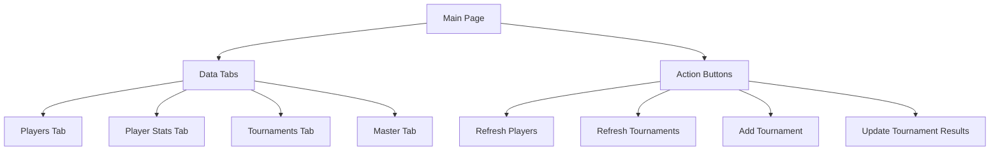
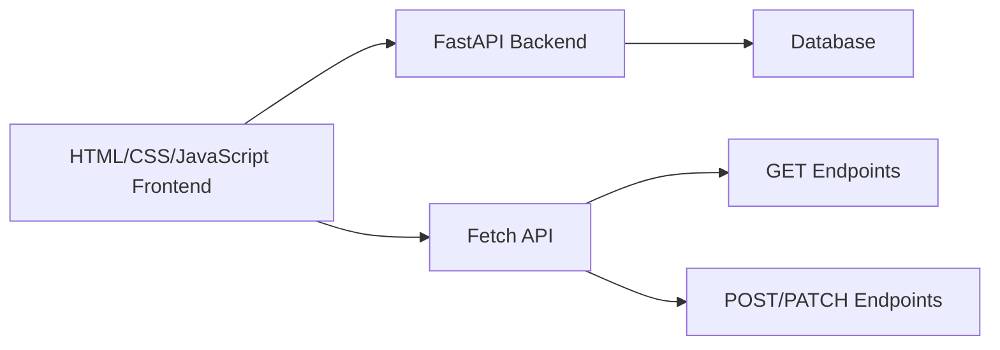

# Frontend and Backend Plan for PGA Betting Model

## Frontend Architecture

## Technical Architecture

## Backend Modifications

We'll make the following modifications to prevent duplicates and ensure proper data integrity:

1. **Prevent Duplicate Players**:
   - Modify the player creation/update logic to check if a player already exists
   - Use upsert operations (update if exists, insert if not) instead of always inserting

2. **Prevent Duplicate Tournament + Year Combinations**:
   - Add a unique constraint or check in the `create_tournament_record` function
   - Before adding a new tournament record, check if the tournament + year combination already exists

3. **Ensure Stats Updates are Per Player Per Tournament Per Year**:
   - Modify the `update_sg_stats` and `update_tournament_results` functions to properly identify and update specific records
   - Use player_id + tournament_name + year as a composite key for updates

## Implementation Steps

1. **Backend Modifications**:
   - Add CORS support to FastAPI
   - Update the CRUD functions to prevent duplicates
   - Update the API endpoints to handle the modified CRUD functions

2. **Frontend Implementation**:
   - Create the HTML, CSS, and JavaScript files
   - Place them in a static directory served by FastAPI

3. **Integration**:
   - Configure FastAPI to serve the static files
   - Test the frontend-backend integration

4. **Testing**:
   - Test all functionality with a focus on duplicate prevention
   - Verify that players cannot be duplicated
   - Verify that tournament + year combinations cannot be duplicated
   - Verify that stats updates are correctly applied per player per tournament per year
